# RETINA-Q — Algorithm Workflow Diagram

End-to-end flow from image upload to diagnostic output and physician feedback.

```mermaid
flowchart TD
    %% ── User / Frontend ──────────────────────────────────────
    A([👤 Clinician]) -->|Selects image file\nOCT or Fundus| B

    subgraph FE["Frontend  (Next.js)"]
        B[Upload Form\nJPEG / PNG]
        B -->|POST /api/predict/oct\nor /api/predict/fundus| C
        POL[Poll GET /api/jobs/job_id\nor SSE /api/jobs/job_id/stream]
        DISP[Display Results\n+ Explainability Maps]
        FB[Physician Feedback\nAccept / Override]
    end

    %% ── API Layer ────────────────────────────────────────────
    subgraph BE["Backend  (FastAPI)"]
        C[Validate Request\nimage/*, size ≤ limit]
        C -->|Save bytes to disk\ngenerate job_id| D
        D[/uploads/job_id.ext/]
        D -->|Dispatch Celery task\ntask_id = job_id| E
        C -->|202 Accepted\njob_id| POL
    end

    %% ── Async Workers ────────────────────────────────────────
    subgraph CW["Celery Worker  (Redis Broker)"]
        E{Image Type?}

        %% OCT Branch
        E -->|OCT| F1
        subgraph OCT["OCT Pipeline"]
            F1[Load Image from Disk]
            F1 --> F2[Classical Feature Extraction\n64 statistical features\ngradient · histogram · LBP · texture]
            F2 --> F3[Linear 64→32 → ReLU → BN → Dropout\nLinear 32→8 → Tanh]
            F3 --> F4["8-Qubit Quantum Circuit\n(PennyLane default.qubit)\nAngle Embedding → 8 variational layers\nRY/RZ + CNOT ring entanglement"]
            F4 --> F5[Linear 8→32 → ReLU → BN → Dropout\nLinear 32→16 → 16→1 → Sigmoid]
            F5 --> F6[Prediction: Normal / CSR\n+ confidence + probability]
            F6 --> F7[Feature Importance Map\ngradient-based explainability\n→ heatmap_base64]
        end

        %% Fundus Branch
        E -->|Fundus| G1
        subgraph FUN["Fundus Pipeline"]
            G1[Load Image from Disk]
            G1 --> G2[Preprocess 224×224 RGB]
            G2 --> G3[EfficientNet-B0 Backbone\n1280-dim feature vector]
            G3 --> G4[Linear 1280→64 → ReLU → Dropout\nLinear 64→4 → Tanh]
            G4 --> G5["4-Qubit Quantum Circuit\n(PennyLane default.qubit)\nAngle Embedding → 6 variational layers\nRY/RZ + CNOT ring entanglement"]
            G5 --> G6[Concat classical_4 + quantum_4\nLinear 8→32 → ReLU → BN\nLinear 32→16 → 16→1 → Sigmoid]
            G6 --> G7[Prediction: Healthy / CSCR\n+ confidence + probability]
            G7 --> G8[Grad-CAM Heatmap\n→ gradcam_base64]
            G7 -->|disease detected| G9
            subgraph SEG["Macular Segmentation  (conditional)"]
                G9[Green Channel Extraction\n+ CLAHE normalization]
                G9 --> G10[U-Net Encoder\n1→64→128→256→512→1024]
                G10 --> G11[U-Net Decoder\nwith skip connections]
                G11 --> G12[Post-processing\nBinarise → Largest CC\n→ Morphological close/open]
                G12 --> G13[mask_base64 + overlay_base64\n+ mask_area_ratio]
            end
        end
    end

    %% ── Storage ──────────────────────────────────────────────
    subgraph DB["Storage"]
        PG[(PostgreSQL\nscans table\njob_id · prediction · confidence\nprobability · mask_area_ratio)]
        RD[(Redis\nCelery result backend\njob state · result JSON)]
    end

    F7 -->|Save scan record| PG
    G8 -->|Save scan record| PG
    G13 -->|Save scan record| PG

    F7 -->|Store result| RD
    G8 -->|Store result| RD
    G13 -->|Store result| RD

    %% ── Result delivery ──────────────────────────────────────
    RD -->|Job complete| POL
    POL --> DISP

    subgraph OUT["Output  (Frontend Dashboard)"]
        DISP --> R1[Prediction Label\n+ Confidence Score]
        DISP --> R2[Explainability Map\nGrad-CAM or Feature Importance]
        DISP -->|Fundus only| R3[Segmentation Overlay\n+ Mask Area Ratio]
    end

    %% ── Feedback Loop ────────────────────────────────────────
    R1 --> FB
    R2 --> FB
    R3 --> FB
    FB -->|POST /api/feedback\naccept / reject + correction label| FBK

    subgraph FBK["Feedback Service"]
        FBL[Append to feedback_log.jsonl]
        FBL -->|verdict = reject| QRN[Quarantine image\nwith correction label\nfor future retraining]
    end

    %% ── Shadow Deployment ────────────────────────────────────
    CW -.->|shadow_enabled| SHD[(Shadow Log\nshadow_predictions.jsonl)]

    %% ── Styling ──────────────────────────────────────────────
    style FE fill:#1a1a2e,color:#e0e0e0,stroke:#4a4a8a
    style BE fill:#16213e,color:#e0e0e0,stroke:#4a4a8a
    style CW fill:#0f3460,color:#e0e0e0,stroke:#4a4a8a
    style OCT fill:#0d2137,color:#e0e0e0,stroke:#2a6496
    style FUN fill:#0d2137,color:#e0e0e0,stroke:#2a6496
    style SEG fill:#0b1a2b,color:#e0e0e0,stroke:#1a5276
    style DB  fill:#1a1a2e,color:#e0e0e0,stroke:#4a4a8a
    style OUT fill:#1a1a2e,color:#e0e0e0,stroke:#4a4a8a
    style FBK fill:#1a1a2e,color:#e0e0e0,stroke:#4a4a8a
```

## Key Flow Summary

| Stage | Component | Description |
|---|---|---|
| **1. Upload** | Frontend | Clinician uploads a JPEG/PNG OCT or Fundus image |
| **2. Validation** | FastAPI | Content-type check, size limit, save to disk |
| **3. Dispatch** | Celery + Redis | Task queued asynchronously; `job_id` returned immediately |
| **4a. OCT Inference** | Celery Worker | 64 classical features → 8-qubit VQC → binary label |
| **4b. Fundus Inference** | Celery Worker | EfficientNet-B0 → 4-qubit VQC → binary label |
| **4c. Segmentation** | Celery Worker | U-Net macular segmentation (conditional on disease detection) |
| **5. Explainability** | Celery Worker | Grad-CAM (Fundus) or Feature Importance heatmap (OCT) |
| **6. Storage** | PostgreSQL + Redis | Scan record persisted; Celery result stored for polling |
| **7. Polling / SSE** | FastAPI + Frontend | Client polls `/api/jobs/{id}` or subscribes to SSE stream |
| **8. Display** | Frontend Dashboard | Prediction, confidence, explainability map, segmentation overlay |
| **9. Feedback** | FastAPI | Physician accepts or overrides; rejected images quarantined for retraining |
