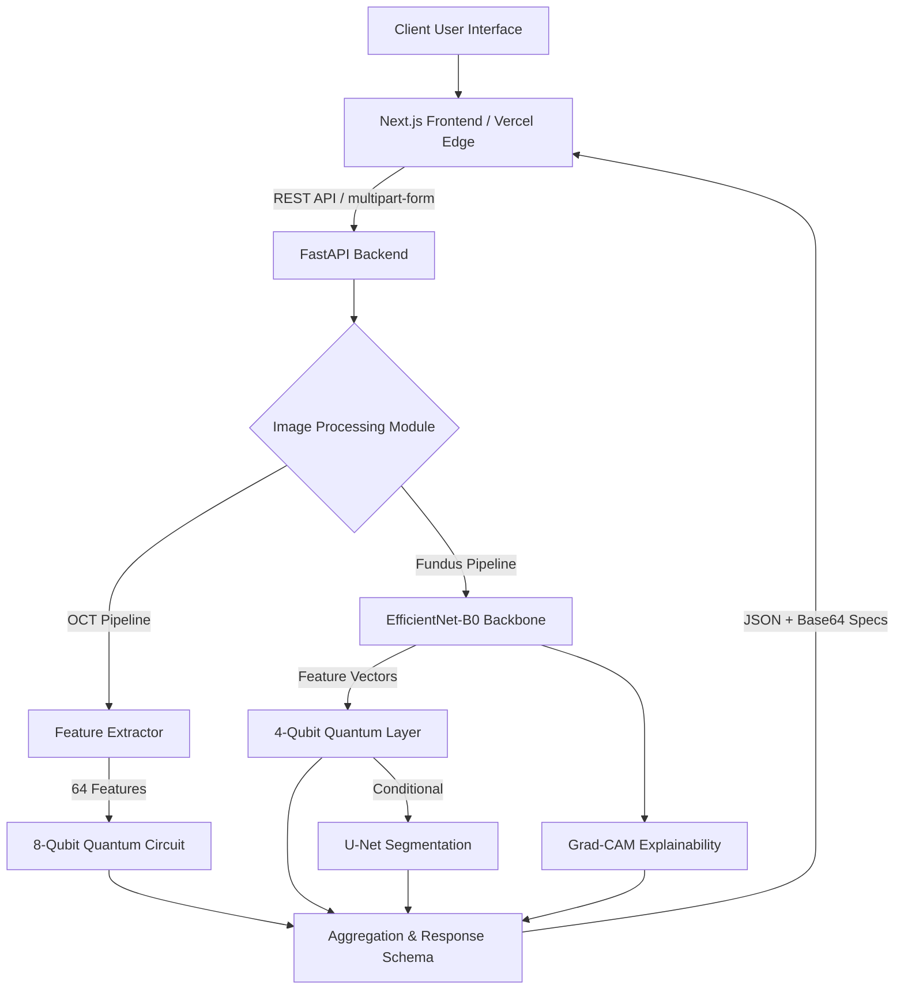

# RETINA-Q System Architecture

RETINA-Q is built on a modern, decoupled microservices architecture designed to isolate heavy Machine Learning workloads from the Client Interfaces.

## High-Level Data Flow

1. **Client Layer (Next.js / Capacitor Mobile)**: The user uploads a `.jpg` or `.png` retinal scan (OCT or Fundus) via the browser or native mobile app.
2. **API Gateway (FastAPI)**: The request hits the `POST /api/predict/{type}` endpoint.
3. **Preprocessing Pipeline (OpenCV)**: Images are normalized, resized to `224x224`, and undergo CLAHE (Contrast Limited Adaptive Histogram Equalization).
4. **Machine Learning Core (PyTorch & PennyLane)**:
    - **OCT**: 64 statistical features are extracted and fed into an 8-qubit quantum classifier.
    - **Fundus**: Image flows through an EfficientNet-B0 backbone. The output maps directly into a 4-qubit quantum layer.
    - **Segmentation**: If required, a U-Net model predicts macular regions.
5. **Explainability Engine**: Computes Grad-CAM heatmaps to visually explain the CNN predictions.
6. **Response Generation**: Structured JSON containing the prediction, confidence scores, and base64 encoded heatmaps/masks is returned to the client.

## Component Block Diagram

## Infrastructure

The entire system is containerized via Docker.
- **`backend/Dockerfile`**: A heavy Python 3.11 image pre-loaded with OpenCV, PyTorch, PennyLane, and Uvicorn.
- **`frontend/Dockerfile`**: A lightweight, multi-stage Node 20 Alpine environment running Next.js in static/standalone mode.
- **`docker-compose.yml`**: Orchestrates both containers along with Postgres and Redis on a single virtual network.
